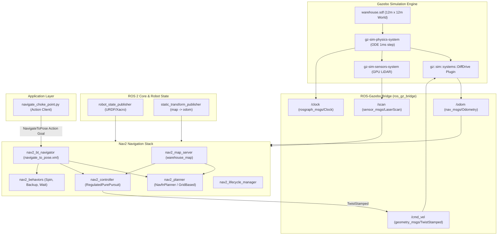
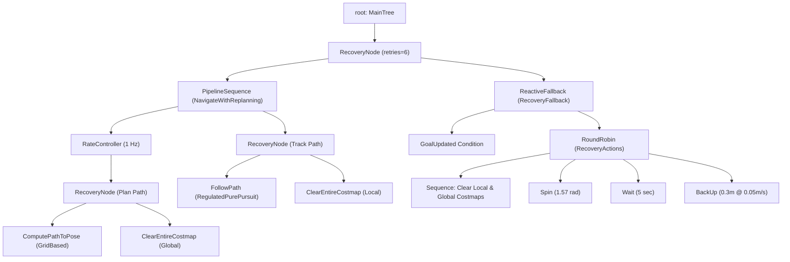

# AMR Simulation Project: Comprehensive Technical Report

---

## 1. Project Overview & Executive Summary

### 1.1 Project Objectives
The **AMR Simulation** project is an end-to-end autonomous mobile robot development environment built on **ROS 2** and **modern Gazebo Sim (Harmonic/Gz Sim)**. The primary objective is designing, simulating, and autonomously navigating a differential-drive Autonomous Mobile Robot (AMR) through a challenging warehouse environment featuring a narrow central **choke point (1.15 m width)**.

The project encompasses:
1. **Robot Mechanical & Sensor Modeling**: A custom differential-drive AMR parameterized via Xacro, featuring realistic inertial matrices, differential drive actuators, a caster support wheel, and a 360° 2D LiDAR sensor.
2. **Synthetic Simulation World**: A realistic 12 m × 12 m enclosed warehouse facility created in Gazebo Simulation Description Format (SDF), containing perimeter boundaries and obstacle walls configured with physics and lighting engines.
3. **Synthetic Map Generation**: A standalone Python rasterization pipeline translating SDF world physics dimensions into high-resolution discrete occupancy grids (`.pgm` and `.yaml`) compatible with the Nav2 Map Server.
4. **Nav2 Navigation Stack Integration**: A complete navigation system employing the **Navfn Planner** (global route planning), the **Regulated Pure Pursuit Controller** (path tracking optimized for non-holonomic robots in constrained environments), multi-layered costmaps (Static, Obstacle, and Inflation), and a customized Behavior Tree.
5. **Mission Automation**: An asynchronous ROS 2 Action Client script dispatching navigation goals through the bottleneck corridor while reporting real-time progress metrics.

---

### 1.2 System Architecture



---

### 1.3 Coordinate Frame Transformations (TF Tree)

The transform tree establishes the spatial relationship between global world coordinates and individual robot links:

```mermaid
graph LR
    map["map (Global World Origin)"] -->|static_transform_publisher [-4.0, 0.0, 0.0]| odom["odom (Odometry Origin)"]
    odom -->|Gazebo DiffDrive Plugin| base_footprint["base_footprint (Ground Projection)"]
    base_footprint -->|base_joint [0, 0, 0.1]| base_link["base_link (Chassis Center)"]
    base_link -->|left_wheel_joint| left_wheel["left_wheel"]
    base_link -->|right_wheel_joint| right_wheel["right_wheel"]
    base_link -->|caster_joint| caster_wheel["caster_wheel"]
    base_link -->|lidar_joint [0, 0, 0.125]| lidar_link["lidar_link"]
```

---

## 2. What Has Been Done: Milestones & Engineering Solutions

### Milestone 1: Kinematic & Dynamic Robot Modeling (`amr.xacro`)
- Designed a custom rectangular chassis with a 0.6 m length, 0.5 m width, and 0.2 m height.
- Implemented a differential drive layout with two lateral drive wheels (radius 0.1 m, width 0.05 m) driven by continuous revolute joints, complemented by a passive low-friction spherical caster wheel for 3-point static equilibrium.
- Modeled realistic physical mass properties (10 kg chassis, 1 kg per wheel, 0.5 kg caster) and analytic principal moments of inertia calculated using standard geometric tensor equations ($I_{xx}, I_{yy}, I_{zz}$).
- Integrated Gazebo system plugins directly into the URDF:
  - `gz::sim::systems::DiffDrive`: Handles kinematic actuation, wheel odometry generation, and coordinate frame broadcasting.
  - `gz::sim::systems::JointStatePublisher`: Emits wheel joint states.
  - `gpu_lidar`: Simulates a high-fidelity scanning laser rangefinder with Gaussian measurement noise.

### Milestone 2: Synthetic Environment Simulation (`warehouse.sdf`)
- Engineered a 12 m × 12 m enclosed facility surrounded by 2 m tall perimeter walls.
- Constructed a critical central partition splitting the environment into east and west halves, creating a narrow **1.15 m wide corridor** located between $(x=0, y=-0.575)$ and $(x=0, y=0.575)$.
- Configured rendering and physics plugins under the modern OGRE2 engine, standard directional lighting, and an ODE ground surface with calibrated friction coefficients ($\mu = 1.0$) to eliminate wheel slippage.

### Milestone 3: Algorithmic Raster Map Generation (`generate_map.py`)
- Created a mathematical script that directly derives occupancy grid maps from the SDF geometry, avoiding the need to manually drive the robot with SLAM.
- Configured a 240 × 240 grid with a 0.05 m resolution (covering exactly 12 m × 12 m), with grid cell origin at $(-6.0, -6.0)$.
- Exported both the Netpbm P2 ASCII grayscale image (`warehouse_map.pgm`) and its metadata companion (`warehouse_map.yaml`) configured for trinary occupancy representation.

### Milestone 4: Modular Nav2 Navigation Stack (`nav2_params.yaml`, `navigate_to_pose.xml`, `nav2_bringup.launch.py`)
- Configured Nav2 servers: `nav2_map_server`, `nav2_planner`, `nav2_controller`, `nav2_behaviors`, `nav2_bt_navigator`, and `nav2_lifecycle_manager`.
- Set the global path planner to `nav2_navfn_planner::NavfnPlanner`.
- Set the path tracking controller to `nav2_regulated_pure_pursuit_controller::RegulatedPurePursuitController`.
- Tailored global and local costmap layers, establishing precise robot footprints (`[ [0.3, 0.25], [0.3, -0.25], [-0.3, -0.25], [-0.3, 0.25] ]`) and cost scaling factors.

### Milestone 5: Critical Bug Diagnostics & Fixes
1. **Message Type Mismatch on `/cmd_vel`**:
   - *Problem*: Nav2 controllers in recent ROS 2 releases emit velocity commands as `geometry_msgs/msg/TwistStamped` (including a header timestamp). The bridge was previously expecting unstamped `geometry_msgs/msg/Twist`. This caused `ros_gz_bridge` to ignore all navigation velocity commands, keeping the robot stationary and causing Nav2's `progress_checker` to abort.
   - *Solution*: Updated the bridge configuration in `warehouse_world.launch.py` to `/cmd_vel@geometry_msgs/msg/TwistStamped]gz.msgs.Twist`.
2. **Narrow Choke Point Clearance Tuning**:
   - *Problem*: Default costmap inflation values caused the inflation gradients from both choke walls to overlap, completely blocking the 1.15 m gap in the costmap and prompting Nav2 to reject navigation paths.
   - *Solution*: Tuned `inflation_radius: 0.45` and `cost_scaling_factor: 3.0` across both local and global costmaps. With an effective half-width footprint of 0.25 m + 0.05 m safety margin, a traversable corridor was established through the bottleneck.
3. **Simulation Clock Synchronization**:
   - *Problem*: Node synchronization failures caused by mixed real-world system clocks and Gazebo simulation time.
   - *Solution*: Bridged `/world/warehouse_world/clock` to ROS `/clock` and enforced `use_sim_time: True` across all ROS 2 nodes, lifecycle managers, and action clients.

---

## 3. Exhaustive File-by-File & Section-by-Section Breakdown

---

### File 1: `package.xml`
**Path**: [`src/amr_simulation/package.xml`](file:///home/prathmesh/amr_ws/src/amr_simulation/package.xml)  
**Purpose**: ROS 2 package manifest declaring build system requirements, package metadata, and runtime dependencies.

| Line Range | Section / Tag | Detailed Purpose & Functionality |
| :--- | :--- | :--- |
| **Lines 1–3** | XML Header & Schema Validation | Identifies the file as XML and declares conformance to ROS 2 Package Format 3 schema specifications. |
| **Lines 4–8** | Package Identity Metadata | Sets package name to `amr_simulation`, sets version to `0.0.0`, declares maintainer identity, and includes license placeholder. |
| **Lines 10–11** | Buildtool Dependency | Declares `<buildtool_depend>ament_cmake</buildtool_depend>`, specifying CMake via Ament as the build backend. |
| **Lines 12–17** | Core ROS & Simulation Dependencies | Defines build and execution dependencies: `rclcpp` (C++ client library), `rclpy` (Python client library), `xacro` (XML macro processing for robot models), `robot_state_publisher` (forward kinematics), `ros_gz_sim` (Gazebo Sim core wrappers), and `ros_gz_bridge` (bidirectional transport bridge). |
| **Lines 19–21** | Test Dependencies | Declares testing linters: `ament_lint_auto` and `ament_lint_common` for static code analysis. |
| **Lines 22–25** | Build Type Export | Declares `<build_type>ament_cmake</build_type>` inside the export block, instructing colcon how to build the package. |

---

### File 2: `CMakeLists.txt`
**Path**: [`src/amr_simulation/CMakeLists.txt`](file:///home/prathmesh/amr_ws/src/amr_simulation/CMakeLists.txt)  
**Purpose**: CMake build configuration defining compilation rules, dependency discovery, asset installation, and ament indexing.

| Line Range | Section / Directive | Detailed Purpose & Functionality |
| :--- | :--- | :--- |
| **Lines 1–2** | CMake & Project Definition | Enforces `cmake_minimum_required(VERSION 3.20)` and names the project `amr_simulation`. |
| **Lines 4–6** | Compiler Optimization Flags | Checks for GCC or Clang and applies `-Wall -Wextra -Wpedantic` to enforce code quality and standard compliance. |
| **Lines 8–11** | Dependency Discovery | Uses `find_package()` to resolve required ROS 2 build dependencies: `ament_cmake`, `rclcpp`, and `rclpy`. |
| **Lines 13–23** | Testing & Linters Setup | Configures testing conditionals (`BUILD_TESTING`). Skips copyright and git-dependent cpplint checks when running uncommitted in development. |
| **Lines 25–28** | Directory Asset Installation | Installs asset folders (`worlds`, `models`, `launch`, `config`, `maps`) into the shared package directory (`share/amr_simulation`), making them accessible to launch files and the ROS 2 index. |
| **Lines 30–33** | Python Executables Installation | Uses `install(PROGRAMS ... DESTINATION lib/${PROJECT_NAME})` to install executable Python scripts (`generate_map.py`, `navigate_choke_point.py`) so they can be executed via `ros2 run amr_simulation <script>`. |
| **Line 35** | Ament Packaging Macro | Invokes `ament_package()`, generating CMake configuration files, package environment hooks, and registering the package with `ament_index`. |

---

### File 3: `models/amr.xacro`
**Path**: [`src/amr_simulation/models/amr.xacro`](file:///home/prathmesh/amr_ws/src/amr_simulation/models/amr.xacro)  
**Purpose**: Comprehensive kinematic and dynamic robot description defining links, joints, visual/collision properties, LiDAR sensors, and Gazebo plugins.

| Line Range | Section / Element | Detailed Purpose & Functionality |
| :--- | :--- | :--- |
| **Lines 1–2** | Root XML & Namespace | Declares the file as XML and sets up the root `<robot>` element named `amr` with the Xacro schema namespace. |
| **Lines 3–9** | `base_footprint` & `base_joint` | Defines `base_footprint` as a dummy root link on the ground plane ($z=0$). Attaches `base_link` via a fixed joint offset by $z=+0.1\text{ m}$, aligning the chassis bottom above the ground so the wheels make proper contact. |
| **Lines 11–29** | `base_link` Chassis | Models the main chassis: visual and collision boxes of size $0.6\text{ m} \times 0.5\text{ m} \times 0.2\text{ m}$ (colored blue), mass of $10.0\text{ kg}$, and diagonal inertia tensor elements ($I_{xx}=0.24, I_{yy}=0.33, I_{zz}=0.5$). |
| **Lines 31–58** | Wheel Macro Definition (`wheel`) | Reusable macro parameterizing drive wheels with `prefix` ("left"/"right") and `y_reflect` ($+1/-1$). Each wheel is a cylinder of radius $0.1\text{ m}$, length $0.05\text{ m}$, mass $1.0\text{ kg}$, with continuous revolute joint rotated by $-90^\circ$ around X and rotating around local Z. Joint offset: $y = \pm 0.275\text{ m}$. |
| **Lines 60–61** | Wheel Instantiations | Calls `<xacro:wheel prefix="left" y_reflect="1"/>` and `<xacro:wheel prefix="right" y_reflect="-1"/>`, creating `left_wheel` at $y=+0.275\text{ m}$ and `right_wheel` at $y=-0.275\text{ m}$ (total track width $0.55\text{ m}$). |
| **Lines 63–85** | Caster Wheel Link & Joint | Defines a passive spherical front caster of radius $0.05\text{ m}$, mass $0.5\text{ kg}$, connected to `base_link` at $x=+0.2\text{ m}, y=0.0\text{ m}, z=-0.05\text{ m}$ to provide stable three-point contact. |
| **Lines 87–111** | LiDAR Link & Joint | Defines a cylindrical LiDAR sensor housing (radius $0.05\text{ m}$, length $0.05\text{ m}$, mass $0.1\text{ kg}$) attached at $x=0.0, y=0.0, z=+0.125\text{ m}$ atop the chassis. |
| **Lines 113–141** | Gazebo GPU LiDAR Sensor | Attaches a `<sensor name="lidar" type="gpu_lidar">` to `lidar_link`. Configures 360 horizontal samples covering a full $360^\circ$ field of view ($-\pi$ to $+\pi$), 10 Hz scan rate, $0.12\text{ m}$ to $10.0\text{ m}$ range, Gaussian noise ($\sigma=0.01\text{ m}$), publishing directly to topic `/scan`. |
| **Lines 143–155** | Gazebo DiffDrive System Plugin | Integrates `gz::sim::systems::DiffDrive`. Binds `left_wheel_joint` and `right_wheel_joint`, specifies wheel separation ($0.55\text{ m}$) and wheel radius ($0.1\text{ m}$), subscribes to `cmd_vel`, and publishes odometry to `/odom` and TF from `odom` to `base_footprint` at 50 Hz. |
| **Lines 157–160** | Joint State Publisher Plugin | Integrates `gz::sim::systems::JointStatePublisher` to publish instantaneous wheel joint angles to `/joint_states`. |

---

### File 4: `worlds/warehouse.sdf`
**Path**: [`src/amr_simulation/worlds/warehouse.sdf`](file:///home/prathmesh/amr_ws/src/amr_simulation/worlds/warehouse.sdf)  
**Purpose**: Simulation world definition containing physics parameters, world simulation plugins, GUI viewports, lighting, and static warehouse architecture.

| Line Range | Section / Tag | Detailed Purpose & Functionality |
| :--- | :--- | :--- |
| **Lines 1–7** | World & Physics Properties | Declares SDF 1.8 `<world name="warehouse_world">`. Sets physics step size to $0.001\text{ s}$ (1 kHz simulation loop) with a target real-time update factor of 1.0. |
| **Lines 9–26** | Gazebo Sim Core Plugins | Loads essential system plugins: `Physics` (ODE dynamics), `UserCommands` (spawn/delete entities), `SceneBroadcaster` (state synchronization), and `Sensors` (OGRE2 rendering pipeline for LiDAR and camera raycasting). |
| **Lines 28–84** | GUI Viewport & Controls | Configures the simulation UI: `3D View` (OGRE2 engine, camera pose at $x=-9.0, z=10.0$ looking downward at $0.8\text{ rad}$ pitch), `World control` (floating play/pause/step controls), and `World stats` (real-time factor and simulation iteration timers). |
| **Lines 86–99** | Lighting Configuration | Adds a directional sunlight model (`sun`) positioned at $(0, 0, 10)$ angled along $(-0.5, 0.1, -0.9)$ with diffuse illumination and shadow casting. |
| **Lines 101–134** | Ground Plane Model | Creates a static $30\text{ m} \times 30\text{ m}$ horizontal ground plane with ODE friction coefficients ($\mu = 1.0, \mu_2 = 1.0$) to support proper wheel traction. |
| **Lines 136–183** | Perimeter Boundary Walls | Constructs 2 m tall outer walls enclosing a $12\text{ m} \times 12\text{ m}$ area: `wall_north` at $y=+6\text{ m}$, `wall_south` at $y=-6\text{ m}$, `wall_west` at $x=-6\text{ m}$, and `wall_east` at $x=+6\text{ m}$. |
| **Lines 185–209** | Choke Point Barrier Walls | Constructs the central partition dividing the warehouse into east and west halves. Two walls of size $0.4\text{ m} \times 5.4\text{ m} \times 2.0\text{ m}$ (`choke_wall_top` at $y=+3.36\text{ m}$ and `choke_wall_bottom` at $y=-3.36\text{ m}$) leave a narrow **1.15 m wide corridor** at the origin $(x=0, y=0)$. |

---

### File 5: `scripts/generate_map.py`
**Path**: [`src/amr_simulation/scripts/generate_map.py`](file:///home/prathmesh/amr_ws/src/amr_simulation/scripts/generate_map.py)  
**Purpose**: Deterministic map generator converting world geometric specifications into a 2D occupancy grid image and YAML metadata.

| Line Range | Section / Function | Detailed Purpose & Functionality |
| :--- | :--- | :--- |
| **Lines 1–8** | Constants & Dimensions | Imports `os`. Configures map bounds: $240 \times 240$ cells, resolution of $0.05\text{ m/cell}$ ($12\text{ m} \times 12\text{ m}$ total coverage), and origin offset $(-6.0, -6.0)$. |
| **Lines 9–12** | `world_to_grid(x, y)` | Coordinate transform converting continuous metric world coordinates $(x, y)$ to discrete image grid indices $(g_x, g_y)$ using the formula $g = \text{int}((pos - origin) / resolution)$. |
| **Lines 14–15** | Grid Allocation | Allocates a 2D list of dimensions $240 \times 240$ initialized with pixel intensity `255` (representing completely free, unoccupied space). |
| **Lines 17–22** | `draw_rect(x_min, ...)` | Rasterization utility. Converts continuous rectangular bounds to pixel coordinates and fills the enclosed cells with `0` (occupied space / obstacle). |
| **Lines 24–28** | Perimeter Wall Rasterization | Calls `draw_rect` for the outer boundaries: North ($y \in [5.8, 6.0]$), South ($y \in [-6.0, -5.8]$), East ($x \in [5.8, 6.0]$), and West ($x \in [-6.0, -5.8]$). |
| **Lines 30–32** | Choke Point Rasterization | Rasterizes the central choke barriers: Top wall ($x \in [-0.2, 0.2], y \in [0.66, 6.0]$) and Bottom wall ($x \in [-0.2, 0.2], y \in [-6.0, -0.66]$), leaving an open gap between $y=-0.66$ and $y=+0.66$ ($1.32\text{ m}$ nominal open space for the $1.15\text{ m}$ physical clearance). |
| **Lines 34–40** | Output Path Resolution | Resolves the destination directory dynamically (`../maps/`) and ensures the folder exists via `os.makedirs`. |
| **Lines 42–46** | Netpbm P2 Image Serialization | Writes `warehouse_map.pgm` in ASCII Netpbm P2 format. Writes header (`P2`, width, height, max grayscale `255`), then writes row scanlines in inverted vertical order ($y = \text{height}-1 \dots 0$) to align image coordinates with Cartesian coordinate standards. |
| **Lines 48–58** | YAML Metadata Serialization | Generates `warehouse_map.yaml`, populating metadata fields: image file reference, resolution, origin coordinates, negate flag, and occupancy thresholds. |

---

### File 6: `maps/warehouse_map.yaml` & `warehouse_map.pgm`
**Paths**: [`src/amr_simulation/maps/warehouse_map.yaml`](file:///home/prathmesh/amr_ws/src/amr_simulation/maps/warehouse_map.yaml), [`warehouse_map.pgm`](file:///home/prathmesh/amr_ws/src/amr_simulation/maps/warehouse_map.pgm)  
**Purpose**: Map definition files loaded by `nav2_map_server` to populate the static layer of costmaps.

| Field / Parameter | Value | Technical Description & Nav2 Role |
| :--- | :--- | :--- |
| `image` | `warehouse_map.pgm` | Relative filepath pointing to the grayscale occupancy raster image. |
| `mode` | `trinary` | Costmap conversion mode. Categorizes cell values into three states: Free, Occupied, or Unknown based on threshold parameters. |
| `resolution` | `0.05` | Metric scale per pixel ($0.05\text{ m} = 5\text{ cm}$ per cell). |
| `origin` | `[-6.0, -6.0, 0]` | Real-world $(x, y, z)$ position corresponding to cell $(0, 0)$ (the bottom-left corner of the grid). Centers $(0, 0)$ in the warehouse. |
| `negate` | `0` | Polarity flag. When set to `0`, white pixels (`255`) represent free space, and black pixels (`0`) represent occupied space. |
| `occupied_thresh`| `0.65` | Probability threshold above which cells are marked occupied ($> 65\%$). |
| `free_thresh` | `0.25` | Probability threshold below which cells are marked free ($< 25\%$). Values between 25% and 65% are marked unknown. |

---

### File 7: `launch/warehouse_world.launch.py`
**Path**: [`src/amr_simulation/launch/warehouse_world.launch.py`](file:///home/prathmesh/amr_ws/src/amr_simulation/launch/warehouse_world.launch.py)  
**Purpose**: Primary launch file orchestrating Gazebo, URDF parsing, robot spawning, ROS-Gazebo transport bridging, and Nav2 bringup.

| Line Range | Section / Node | Detailed Purpose & Functionality |
| :--- | :--- | :--- |
| **Lines 1–8** | Imports | Imports standard launch modules (`LaunchDescription`, `IncludeLaunchDescription`, `Node`, `Command`) and package directory resolution helpers. |
| **Lines 10–16** | URDF / Xacro Evaluation | Dynamically executes `xacro amr.xacro` using a launch `Command` substitution to compile the XML macros into a raw URDF string for `robot_description`. |
| **Lines 18–24** | Gazebo Simulator Launch | Includes `gz_sim.launch.py` from `ros_gz_sim` with launch argument `gz_args='-r warehouse.sdf'` to launch Gazebo in headless or GUI execution mode with physics running. |
| **Lines 26–32** | Robot State Publisher | Starts `robot_state_publisher`, consuming `robot_description` and publishing dynamic link transformations to `/tf` based on wheel positions from `/joint_states`. |
| **Lines 34–44** | AMR Model Spawner | Executes the `create` tool from `ros_gz_sim` to spawn the robot model in Gazebo from the `robot_description` topic at coordinates $x=-4.0\text{ m}, y=0.0\text{ m}, z=0.1\text{ m}$. |
| **Lines 46–61** | ROS-Gazebo Parameter Bridge | Deploys `ros_gz_bridge::parameter_bridge` to handle inter-middleware topic translations:<br>• `/scan` (`sensor_msgs/LaserScan` $\leftarrow$ `gz.msgs.LaserScan`)<br>• `/cmd_vel` (`geometry_msgs/TwistStamped` $\rightarrow$ `gz.msgs.Twist`)<br>• `/odom` (`nav_msgs/Odometry` $\leftarrow$ `gz.msgs.Odometry`)<br>• `/tf` (`tf2_msgs/TFMessage` $\leftarrow$ `gz.msgs.Pose_V`)<br>• Clock remapping: `/world/warehouse_world/clock` $\rightarrow$ `/clock` |
| **Lines 63–68** | Nav2 Launch Inclusion | Includes the companion launch script `nav2_bringup.launch.py` to start all autonomous navigation servers. |
| **Lines 70–76** | Launch Description Assembly | Assembles all declared processes into a single `LaunchDescription` sequence for execution. |

---

### File 8: `launch/nav2_bringup.launch.py`
**Path**: [`src/amr_simulation/launch/nav2_bringup.launch.py`](file:///home/prathmesh/amr_ws/src/amr_simulation/launch/nav2_bringup.launch.py)  
**Purpose**: Modular launch file starting the Nav2 stack, static coordinate transforms, and lifecycle management.

| Line Range | Section / Node | Detailed Purpose & Functionality |
| :--- | :--- | :--- |
| **Lines 1–7** | Imports | Imports launch utilities and launch actions. |
| **Lines 9–21** | Path & Lifecycle Declarations | Resolves paths to `nav2_params.yaml` and `warehouse_map.yaml`. Defines the managed lifecycle nodes: `map_server`, `controller_server`, `planner_server`, `behavior_server`, and `bt_navigator`. |
| **Lines 24–32** | Static Transform Publisher | Starts `tf2_ros::static_transform_publisher` broadcasting the transform from `map` to `odom` ($x=-4.0, y=0.0, z=0.0$). This provides localization by aligning the odometric frame with the robot's initial spawn location on the map. |
| **Lines 34–40** | Map Server Node | Launches `nav2_map_server::map_server`, loading `warehouse_map.yaml` and publishing the static occupancy grid to `/map`. |
| **Lines 42–48** | Controller Server Node | Launches `nav2_controller::controller_server`, which runs path-following algorithms and computes `/cmd_vel` velocities at 20 Hz. |
| **Lines 50–56** | Planner Server Node | Launches `nav2_planner::planner_server`, exposing the global route planning action server using the static costmap. |
| **Lines 58–64** | Behavior Server Node | Launches `nav2_behaviors::behavior_server`, hosting recovery behaviors (Spin, BackUp, Wait) to resolve navigation stall conditions. |
| **Lines 66–75** | Behavior Tree Navigator Node | Launches `nav2_bt_navigator::bt_navigator`, using `navigate_to_pose.xml` to orchestrate planning, path tracking, and recoveries. |
| **Lines 77–85** | Lifecycle Manager | Launches `nav2_lifecycle_manager::lifecycle_manager` with `autostart: True`. Transitions all managed navigation nodes through the ROS 2 lifecycle states (Configuring $\rightarrow$ Activating) into the active operational state. |

---

### File 9: `config/nav2_params.yaml`
**Path**: [`src/amr_simulation/config/nav2_params.yaml`](file:///home/prathmesh/amr_ws/src/amr_simulation/config/nav2_params.yaml)  
**Purpose**: Master configuration file specifying operational parameters for all Nav2 navigation nodes.

#### Breakdown by Component Section:

```
nav2_params.yaml
├── amcl (Monte Carlo Localization Filter)
├── bt_navigator (Behavior Tree Navigation Coordinator)
├── controller_server (Local Path Follower & Progress Tracking)
│   ├── progress_checker (Stall Detection)
│   ├── general_goal_checker (Goal Tolerance Verification)
│   └── FollowPath (Regulated Pure Pursuit Controller)
├── local_costmap (Rolling 3m x 3m Dynamic Obstacle Map)
│   ├── obstacle_layer (LiDAR Range Marking & Clearing)
│   └── inflation_layer (Proximity Cost Gradient)
├── global_costmap (Complete 12m x 12m Facility Map)
│   ├── static_layer (Map Server Occupancy Grid)
│   ├── obstacle_layer (Real-Time Sensor Overwrite)
│   └── inflation_layer (Tuned Obstacle Buffering)
├── map_server (Map Server Configuration)
├── planner_server (Global Route Calculation / Navfn)
├── behavior_server (Recovery Behavior Plugins)
├── waypoint_follower (Waypoint Execution Engine)
└── velocity_smoother (Kinematic Limit Enforcement)
```

| Section | Key Parameters | Functional Role & Tuning Rationale |
| :--- | :--- | :--- |
| **`amcl`**<br>(Lines 1–32) | `min_particles: 500`<br>`max_particles: 2000`<br>`robot_model_type: "nav2_amcl::DifferentialMotionModel"`<br>`scan_topic: scan` | Configures adaptive particle filter localization for real environments. (In this simulation, global alignment is provided by the static transform publisher). |
| **`bt_navigator`**<br>(Lines 33–44) | `global_frame: map`<br>`robot_base_frame: base_footprint`<br>`bt_loop_duration: 10`<br>`default_server_timeout: 20` | Coordinates behavior tree ticks at 100 Hz ($10\text{ ms}$ tick duration) and registers the `NavigateToPoseNavigator` plugin. |
| **`controller_server`**<br>(Lines 45–88) | `controller_frequency: 20.0`<br>`progress_checker:` radius $0.5\text{ m}$ / allowance $10.0\text{ s}$<br>`goal_checker:` $xy = 0.25\text{ m}, yaw = 0.25\text{ rad}$<br>`FollowPath:` Regulated Pure Pursuit | Evaluates path tracking at 20 Hz. Uses `SimpleProgressChecker` to verify movement of at least 0.5 m every 10 seconds. The `RegulatedPurePursuitController` scales forward velocity in curves and uses lookahead distances between $0.3\text{ m}$ and $0.9\text{ m}$ ($0.6\text{ m}$ nominal) to maintain stability in narrow spaces. |
| **`local_costmap`**<br>(Lines 89–122) | `rolling_window: true`<br>`width: 3, height: 3, res: 0.05`<br>`footprint: "[[0.3, 0.25], ...]"`<br>`inflation_radius: 0.45`<br>`cost_scaling_factor: 3.0` | Maintains a $3\text{ m} \times 3\text{ m}$ local grid around the robot. The obstacle layer uses LiDAR scan data ($2.5\text{ m}$ marking range, $3.0\text{ m}$ clearing range). The inflation layer uses a tuned radius of $0.45\text{ m}$ to prevent phantom obstacles in narrow passages. |
| **`global_costmap`**<br>(Lines 123–157) | `global_frame: map`<br>`resolution: 0.05`<br>`plugins: static_layer, obstacle_layer, inflation_layer`<br>`inflation_radius: 0.45`<br>`cost_scaling_factor: 3.0` | Covers the full $12\text{ m} \times 12\text{ m}$ facility. Integrates static map data, live LiDAR obstacle updates, and matching inflation parameters ($0.45\text{ m}$) so the global planner finds valid paths through the $1.15\text{ m}$ choke point. |
| **`planner_server`**<br>(Lines 163–173) | `expected_planner_frequency: 20.0`<br>`planner_plugins: ["GridBased"]`<br>`GridBased: nav2_navfn_planner::NavfnPlanner`<br>`use_astar: false, allow_unknown: true` | Computes global paths across the occupancy grid using Dijkstra expansion (`use_astar: false`) with a $0.5\text{ m}$ goal arrival tolerance. |
| **`behavior_server`**<br>(Lines 174–190) | `cycle_frequency: 10.0`<br>`behavior_plugins: ["spin", "backup", "wait"]` | Exposes recovery behaviors: `Spin` ($1.57\text{ rad}$ rotation), `BackUp` ($0.30\text{ m}$ reverse at $0.05\text{ m/s}$), and `Wait` ($5\text{ s}$ pause) for recovery when trapped. |
| **`waypoint_follower`**<br>(Lines 191–200) | `loop_rate: 20`<br>`waypoint_task_executor_plugin: WaitAtWaypoint` | Supports sequential multi-waypoint navigation missions, with configurable pauses at intermediate stops. |
| **`velocity_smoother`**<br>(Lines 201–215) | `smoothing_frequency: 20.0`<br>`max_velocity: [0.8, 0.0, 1.0]`<br>`max_accel: [2.5, 0.0, 3.2]`<br>`max_decel: [-2.5, 0.0, -3.2]` | Enforces kinematic safety limits: max linear speed $0.8\text{ m/s}$, max angular speed $1.0\text{ rad/s}$, max linear acceleration $2.5\text{ m/s}^2$, and max angular acceleration $3.2\text{ rad/s}^2$. |

---

### File 10: `config/navigate_to_pose.xml`
**Path**: [`src/amr_simulation/config/navigate_to_pose.xml`](file:///home/prathmesh/amr_ws/src/amr_simulation/config/navigate_to_pose.xml)  
**Purpose**: Behavior Tree XML specifying the decision logic, planning rates, tracking loops, and recovery fallbacks for navigation missions.



| Line Range | XML Node / Construct | Detailed Purpose & Functionality |
| :--- | :--- | :--- |
| **Lines 4–6** | `<root>` & Primary `<RecoveryNode>` | Defines the root tree and wraps navigation in a recovery node allowing up to **6 recovery attempts** before aborting the mission. |
| **Lines 7–18** | `<PipelineSequence>` | Executes planning and path tracking in parallel: the controller tracks the current path while the planner periodically re-evaluates the route. |
| **Lines 8–13** | Planning Branch & `RateController` | Uses a `RateController` to recompute the global path at **1 Hz**. If planning fails, it clears the global costmap and retries once (`ComputePathToPoseRecovery`). |
| **Lines 14–17** | Tracking Branch & `FollowPathRecovery` | Directs the `FollowPath` controller to follow the computed path. If tracking encounters an issue, it clears the local costmap and retries once. |
| **Lines 19–30** | `<ReactiveFallback>` Recovery Subtree | Triggered if the pipeline fails. First checks `<GoalUpdated/>` to see if a new target was issued. If not, it executes recovery actions sequentially via `<RoundRobin>`:<br>1. Clears both local and global costmaps.<br>2. Rotates the robot $90^\circ$ (`Spin`).<br>3. Pauses for 5 seconds (`Wait`).<br>4. Reverses $0.30\text{ m}$ at $0.05\text{ m/s}$ (`BackUp`). |

---

### File 11: `scripts/navigate_choke_point.py`
**Path**: [`src/amr_simulation/scripts/navigate_choke_point.py`](file:///home/prathmesh/amr_ws/src/amr_simulation/scripts/navigate_choke_point.py)  
**Purpose**: ROS 2 Python application node dispatching navigation goals through the bottleneck and monitoring real-time execution status.

| Line Range | Method / Logic | Detailed Purpose & Functionality |
| :--- | :--- | :--- |
| **Lines 1–9** | Shebang & Imports | Sets Python 3 environment. Imports `rclpy`, `Node`, `ActionClient`, `NavigateToPose` action definitions, and `GoalStatus` codes. |
| **Lines 10–16** | `ChokePointNavigator.__init__` | Initializes node `choke_point_navigator`, enforces `use_sim_time: True`, and instantiates an `ActionClient` for action server `/navigate_to_pose`. |
| **Lines 18–38** | `send_goal(x=4.0, y=0.0)` | Waits up to 10 seconds for the action server to become available. Builds a `NavigateToPose.Goal` target at $(x=4.0, y=0.0)$ in frame `map`, attaches `feedback_callback`, and dispatches the goal asynchronously. |
| **Lines 39–49** | `goal_response_callback` | Verifies whether Nav2 accepted or rejected the goal. If accepted, attaches `get_result_callback` to monitor mission completion. If rejected, logs an error and shuts down. |
| **Lines 50–55** | `feedback_callback` | Receives live feedback from Nav2, logging remaining distance (in meters) and estimated time of arrival (ETA) to the terminal. |
| **Lines 57–69** | `get_result_callback` | Handles the terminal action response: verifies if `status == GoalStatus.STATUS_SUCCEEDED` (choke point cleared) or if the mission was canceled or aborted, then cleans up the node. |
| **Lines 70–80** | `main()` Lifecycle Function | Initializes `rclpy`, instantiates `ChokePointNavigator`, dispatches the goal to $(4.0, 0.0)$, and enters `rclpy.spin()` until completion or keyboard interrupt (`SIGINT`). |

---

## 4. End-to-End Execution Flow

1. **Launch Phase**:
   - `warehouse_world.launch.py` starts Gazebo with `warehouse.sdf`.
   - The Xacro description is compiled into `robot_description`, and `create` spawns the AMR at $(-4.0, 0.0, 0.1)$.
   - `ros_gz_bridge` sets up bidirectional topic bridging, remapping the simulation clock to `/clock`.
   - `nav2_bringup.launch.py` launches the navigation servers and sets up the static `map -> odom` transform.
   - The `lifecycle_manager` configures and activates all Nav2 nodes into the active state.

2. **Mission Dispatch**:
   - Running `navigate_choke_point.py` sends a goal of $(4.0, 0.0)$ to the `/navigate_to_pose` action server.
   - The Behavior Tree (`navigate_to_pose.xml`) receives the target and triggers `ComputePathToPose` at 1 Hz.

3. **Global Path Generation**:
   - `NavfnPlanner` evaluates the costmap and finds a collision-free path from $(-4.0, 0.0)$ through the $1.15\text{ m}$ central corridor to $(4.0, 0.0)$.

4. **Trajectory Tracking & Corridor Traversal**:
   - `RegulatedPurePursuitController` tracks the path, computing velocities at 20 Hz.
   - In open space, the AMR accelerates toward its top speed of $0.8\text{ m/s}$.
   - As it approaches the $1.15\text{ m}$ choke point, the controller automatically regulates forward velocity based on proximity to the obstacle walls.
   - Velocity commands are published as `geometry_msgs/msg/TwistStamped` on `/cmd_vel` and passed to Gazebo's `DiffDrive` plugin.

5. **Goal Arrival**:
   - Once the robot enters the goal tolerance zone ($xy \le 0.25\text{ m}$ of $(4.0, 0.0)$), `general_goal_checker` reports success.
   - The BT returns `SUCCESS`, `navigate_choke_point.py` logs `Goal SUCCEEDED!`, and the node shuts down cleanly.

---

## 5. Build, Execution & Verification Instructions

### 5.1 Building the Workspace
```zsh
cd /home/prathmesh/amr_ws
colcon build --symlink-install
source install/setup.zsh
```

### 5.2 Re-Generating the Map (Optional)
```zsh
python3 src/amr_simulation/scripts/generate_map.py
```

### 5.3 Launching the Simulation & Navigation System
In Terminal 1:
```zsh
source /home/prathmesh/amr_ws/install/setup.zsh
ros2 launch amr_simulation warehouse_world.launch.py
```

### 5.4 Dispatching the Autonomous Choke Point Mission
In Terminal 2:
```zsh
source /home/prathmesh/amr_ws/install/setup.zsh
ros2 run amr_simulation navigate_choke_point.py
```
*(Or directly via Python)*:
```zsh
python3 /home/prathmesh/amr_ws/src/amr_simulation/scripts/navigate_choke_point.py
```

---
*Report generated on September 4, 2026.*
